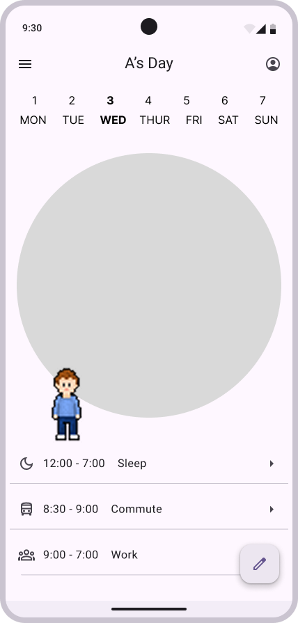
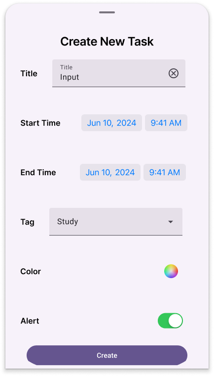
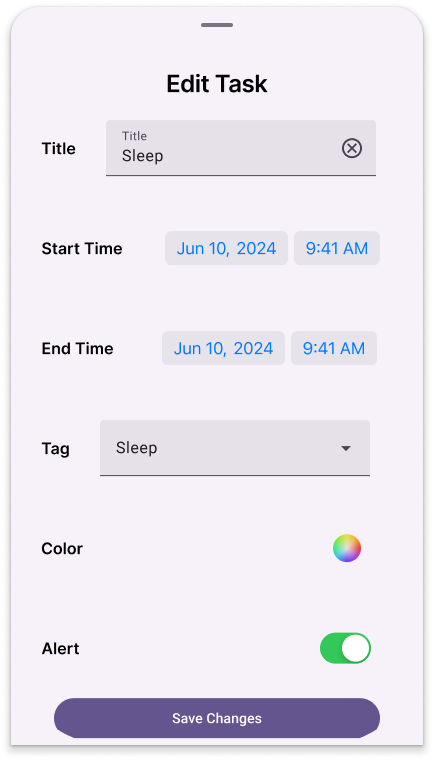
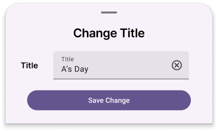

# 🕒 Daily Planner App

A Flutter-based mobile app that helps users manage their daily schedule using a circular timetable.

---

## Project Overview

- **Goal**: Allow users to easily visualize and manage their tasks using clock-like interface.
- **Target Users**: Students, professionals, and anyone who wants to plan their day in hourly blocks.
- **Core Features**:
    - Circualr schedule UI
    - Task creation and editing

---

## UI Mockups

### Main Screen

### Bottom Sheets

